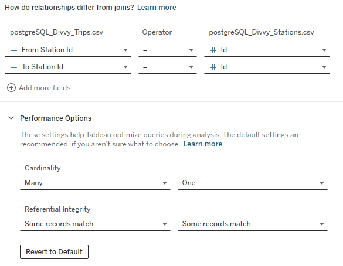
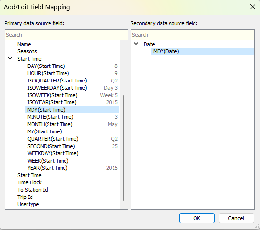
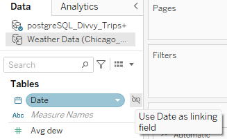
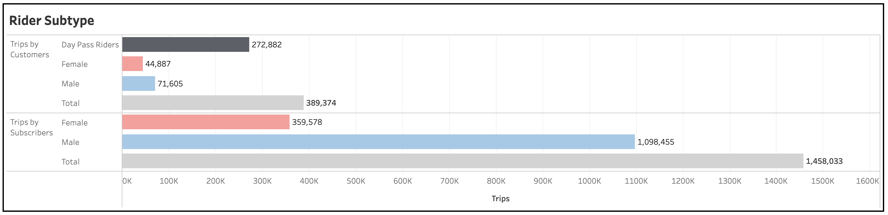
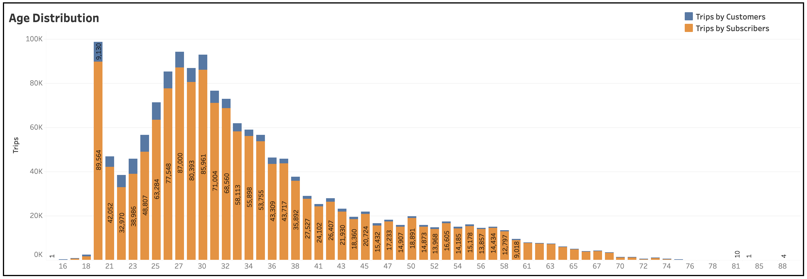
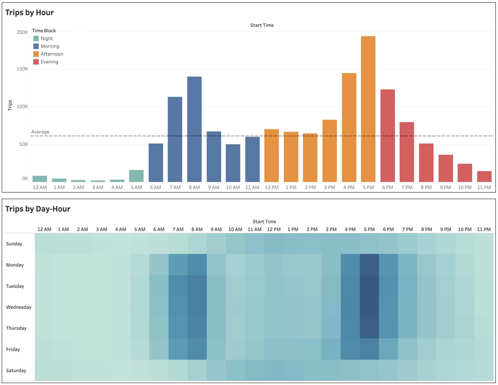
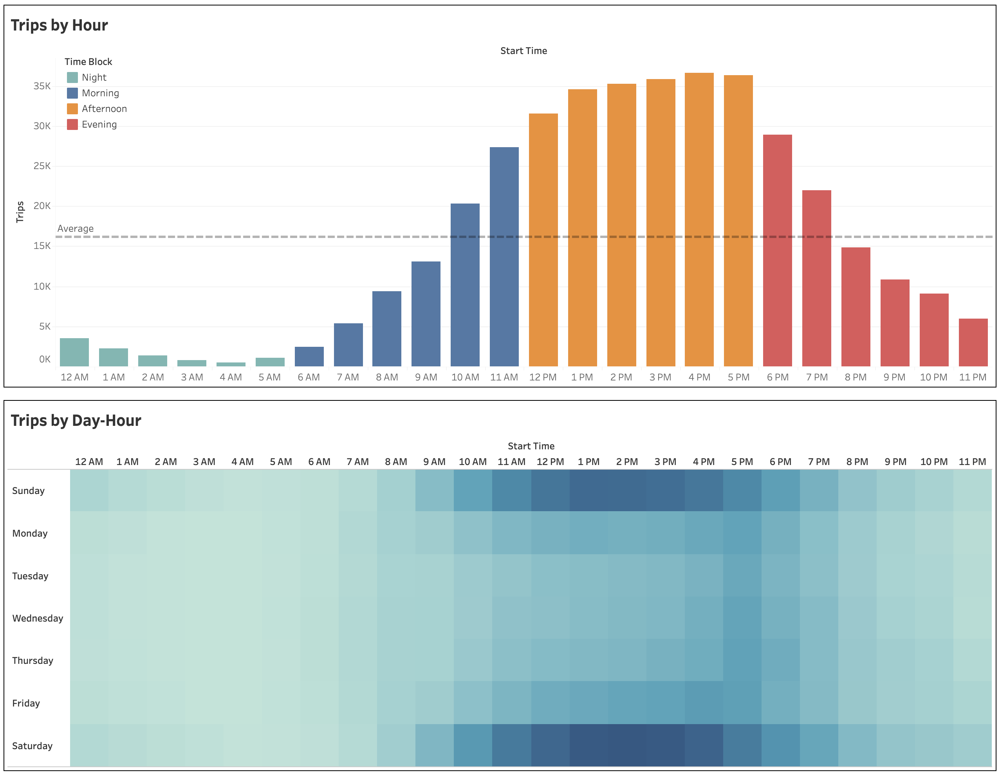

# Divvy Bikes: BI Project Report
The business team reached out to the Reporting and Analytics team asking for *recommendations to increase the revenue by increasing the number of trips and subscribers*. The stakeholders needed a comprehensive overview of the trips taken over the last two years (2018-2019). Based on my performance implementing the data analytics and BI projects, I was assigned to lead the initiative.

**The Data:** \
Divvy publishes the ‘trip’ history data on the official website every quarter. I selected to analyze quarterly data for the years 2018 and 2019.

The ‘stations’ dataset was readily available to download.

The ‘weather’ data needed to be downloaded from a 3rd party. To save the cost and reduce time gathering the data, I decided to manually scrape it from Weather Underground website.

**Tech Stack:**
1. `Python` to combine 8 datasets into a single dataset and analyze the variables for missing values.
2. `Visual Studio Code` to leverage `Jupyter Notebook` and manage the project.
3. `PostgreSQL (pgAdmin)` to use `SQL` to create a database, create relationships between the tables, fix the incorrect/invalid values and outliers, and ensure data consistency and integrity.
4. `Tableau` to visualize and analyze the data, leveraging Descriptive Statistics to examine past performance to find patterns and unearth actionable insights.
5. `Git` to implement version control and enable efficient collaboration between my MacBook, hosting PostgreSQL, and Desktop computer, hosting Tableau Public. Let’s imagine a collab between a Data Analyst and a BI Analyst.
6. `GitHub` to host the project files on the Cloud.

## Extract

The ‘trips’ quarterly datasets, along with the ‘stations’ dataset, were downloaded from [Divvy website](https://divvybikes.com/system-data)

Each **trip** is anonymized and includes:
- Trip start day and time
- Trip end day and time
- Trip start station
- Trip end station
- Rider type (Subscriber, Customer)
- Trip duration
- Gender
- Birthyear

The data has been processed to remove trips that are taken by staff as they service and inspect the system; and any trips that were below 60 seconds in length (potentially false starts or users trying to re-dock a bike to ensure it was secure).

The **station** table includes info regarding:
- Station Name
- Number of docks
- Geospatial Information (Latitude and Longitude)

The ‘weather’ data was manually scraped from [Weather Underground](https://www.wunderground.com/history/monthly/us/il/chicago/KMDW) website.
The data for each month of 2018 and 2019 was copy-pasted in the Microsoft Excel workbook and then imported into the database.

The Chicago **Weather** data contains:
- Windspeed
- Temperature
- Precipitation
- Humidity
- Dew Point
- Pressure

## Transform
### Stage 1: Data Preparation using Python

Divvy publishes the trip history data on the official website every quarter. I selected to work on the quarterly data for the years 2018 and 2019. - https://divvybikes.com/system-data

I used Python (pandas) to check the data for its structure, variables, and missing values. The data would be checked for incorrect/invalid values and the issues would be fixed in PostgreSQL in stage 2 data preparation.

The Python code for stage 1 data preparation can be viewed here - [Data_Prep.ipynb](Data_Prep.ipynb)

**Steps -** 
1. Read all 8 datasets into pandas data frames.
2. Checked for the missing values and structure of each dataset.
3. Sampled the datasets by randomly selecting 25% of the records.
4. The sampled datasets were then combined into a single dataset.
5. The data frame was exported to a CSV file for further analysis and stage 2 data preparation using SQL.

> [!TIP]
> We used `random state = 3` in `sample()` method, doing so the same data/records can be reproduced each time we run the script.

**Why did I sample/reduce the records?** \
On Tableau Public, I’ve experienced that datasets having less than 2 million records tend to load faster. Since this project is a personal challenge, I preferred a faster loading time on the Tableau Public website over presenting real-world numbers for the dashboard.

**Observations and Challenges -**
1. The important columns in the dataset do not contain any NULLS. Fields ‘gender’ and ‘birthyear’ has some missing values.
2. One of the datasets had the same data structure, but the field names were different.
  - The issue was fixed by renaming the fields consistently and then joining the datasets.
3. The final dataset contains ~2 million records, meeting our criterion.

The below table represents the datasets, actual records, and sampled records for each quarter and the total.

| Datasets | Actual Records | Sampled Records |
|----------|----------------|-----------------|
| Q1 2018  | 387,145        | 96,786          |
| Q2 2018  | 1,059,681      | 264,920         |
| Q3 2018  | 1,513,570      | 378,393         |
| Q4 2018  | 642,686        | 160,672         |
| Q1 2019  | 365,069        | 91,267          |
| Q2 2019  | 1,108,163      | 277,041         |
| Q3 2019  | 1,640,718      | 410,180         |
| Q4 2019  | 704,054        | 176,014         |
| **Total**    | **7,421,086**      | **1,855,272**       |

### Stage 2: Data Preparation using SQL

The SQL code for stage 2 data preparation can be viewed here - [Database_Define_Clean_Transform.sql](Database_Define_Clean_Transform.sql)

**Steps -** 
1. Created ‘stations’, ‘trips’, and ‘weather’ tables using appropriate data types and constraints.
2. Imported the data exported in Stage 1 Data Prep and scraped weather data into PostgreSQL using pgAdmin GUI.
3. Fixed the data type mismatch in the ‘birthyear’ and ‘tripduration’ fields using TRIM(), REPLACE(), and typecast functions.
4. Added Foreign key constraints to establish the relationship between the fact and dimension tables.
5. Created an FK Index for each FK constraint to improve the query performance.
6. Dropped the redundant columns 'from_station_name' and 'to_station_name' to follow database design best practices and increase database performance.
7. Checked values in fields for consistency and validity.
8. Removed the wrong values where confident. Also, reached out to the customers to verify the values identified as wrong are actually wrong.
9. Fixed the ‘birthyear’ values based on the customer feedback report.
10. Removed the outliers and illogical values in ‘tripduration’ and ‘birthyear’ fields.
11. Exported the tables to CSV files to connect to Tableau.

> [!IMPORTANT]
> When using Tableau Desktop, we would directly connect to the PostgreSQL database using a connector.

> [!NOTE]
> We used integer data type for ‘birthyear’ so that we could easily calculate the ‘age’ of our customers using numerical functions.

**Entity Relationship Diagram**

## Load
Since Tableau Public does not connect to the PostgreSQL database, I exported the tables to CSV files and stored them on the local storage.

> [!IMPORTANT]
> In the real world, we would perform Stage 2 Data Preparation using SQL and store the data in the staging table, perform the data transformations, and then load the data in the final database that we would use to connect to the Tableau Desktop using a PostgreSQL connector.
> [!Note]
> In case the data structure and format coming from the source stays the same, we would create a Stored Procedure to automate these tasks.

## Analyze

Access the Tableau visualizations on [Tableau Public](https://public.tableau.com/app/profile/himanshu.jagtap/viz/DivvyExecutiveDashboard_17111650001190/DivvyAnalysis)

Established connection between the ‘trips’ and ‘stations’ tables (CSV) and set the one-to-many relationship between ‘station id’ columns in the respective tables.

Added a new data source to connect to the 'weather' table. Established a relationship between the ‘start time’ in the trips table and the ‘date’ field in the 'weather' table by linking the fields as below.

### Riders
To serve our customers well, we must know who our customers are and try to meet their needs well.

Divvy Riders are mainly divided into 3 categories:

**Subscribers**
- Majority Commuters
- Must share ‘gender’ and ‘birthyear’

**Customers**
- Majority Tourists
- Must share ‘gender’ and ‘birthyear’

**Day Pass Riders**
- Riders don’t have to sign up for the Divvy Account
- Do not share ‘gender’ and ‘birthyear’  

**Trips taken by Riders (SubTypes)**

#### Observations 
1. Subscribers vs. Customers:
  - Subscribers dominate the total number of trips compared to customers.
2. Gender Distribution:
  - Among subscribers, males take the vast majority of trips compared to females.
  - Among customers, males also take more trips than females, though the difference is less pronounced.
3. Day Pass Riders:
  - Customers using day passes take a significant number of trips.

**Key Insight**
- ‘Male Subscribers’ are our key customers who take the most trips. (59% of total trips).

#### Recommendations

**Earn ad revenue/sales commission by promoting partner brands:** \
Partner with brands to advertise sales and discounts to the Divvy app users. These ads, along with the link to the product page, would be sent to the subscriber's phone at the end of a trip via push notification.

**Focus on our most frequent riders (Male Subscribers):**

+ **Personalized Offers:** Use data analytics to identify usage patterns among male subscribers and create personalized offers that encourage more frequent use. For example, offer loyalty rewards or discounts for achieving certain ride milestones each month.
+ **Fitness Challenges:** Organize fitness challenges or biking events that cater to competitive and fitness-oriented males, offering prizes or recognition for participation and achievements.
+ **Interest-Based Marketing:** Promote biking as a complementary activity to popular male-dominated interests such as sports, fitness, or commuting. Highlight benefits such as improved health, cost savings, and convenience.

**Attract More Female Riders:**

+ **Women-Specific Promotions:** Offer promotions or discounts for female riders, and create women-focused biking groups or events to foster a sense of community.
+ **Incentive Programs:** Create incentive programs that reward female users for frequent trips, such as bonus loyalty points that can be redeemed for Divvy merchandise or discounted products or services at partner brands.
+ **Partnerships:** Collaborate with organizations focused on women's health and fitness to promote biking as a beneficial activity.
+ **Influencer Partnerships:** Collaborate with female fitness influencers, athletes, or local celebrities to promote Divvy. Use their platforms to reach and engage potential new users within this demographic.

### Age Distribution

Let’s visualize Rider distribution by ‘Age’

For this, we would calculate ‘Age’ using the ‘Birthyear’ field.
Since the latest data we have is 2019, instead of using the TODAY function, we would use the formula 2019 - [BIRTHYEAR]
>[!TIP]
>This situation best describes why the INTEGER data type is recommended for the ‘birthyear’ values.

Wait!, some values do not make sense: (0, 5, 14, 97, 98). These Riders either seem too young or too old to be our riders, hence we would EXCLUDE/FILTER these values. The secondary reason to remove these outliers is to make our visualization more legible and a true representation of our most regular users.

#### Observations
1. Subscribers and customers show a similar usage pattern w.r.t. Number of trips taken by age, but the pattern of weekday trips differs: subscribers take most trips on weekdays and customers take most trips on weekends. 
2. 20-year-old riders have taken the most rides.
3. The other Top 4 age groups, w.r.t. Number of trips taken, are [26, 27, 28, 30].
4. The number of trips declines steadily after age 35.
5. Day Pass Riders do not show any peculiar usage pattern for the age groups.

#### Recommendations
+ Target Age Group 25-35:
  - **Enhanced Membership Packages:** Develop specialized membership packages with benefits tailored to the needs of subscribers aged 25-35, such as discounts for longer rides, partnerships with gyms or fitness centers, and special events or competitions.
  - **Engagement Campaigns:** Launch marketing campaigns targeting this age group through channels they frequently use, such as social media, fitness apps, and commuter-focused advertising.

+ **Re-engage Younger Riders:**
  - Student Discounts: Offer discounted memberships or day passes for students, and partner with universities to provide easy access to bikes on or near campuses.

### Trips by Day-Hour

**Subscribers**

**Observations (Subscribers)**
- When we filter the data by RiderType, we observe that Subscribers exhibit 2 peaks of activity, one in the morning (7 AM to 9 AM) and one in the evening (4 PM to 6 PM), on weekdays. 
- Combining this information with the AGE DISTRIBUTION viz, we can conclude that these are young professionals who commute to work. They must be biking to and from work every day, and a subscription is definitely cheaper for that use.
- Weekend trips are more evenly distributed throughout the day but are generally lower in number compared to weekday peaks.

**Customers and Day Pass Riders**

**Observations (Customers)**
- Customers and Day Pass Riders take frequent rides on weekends between 10 AM and 7 PM. 
- This suggests that the primary use cases for these riders include leisure activities such as visiting tourist attractions or biking alongside the Chicago River.

**Recommendations**

**Working Professionals Focused Plans and Promotions:**
+ **Corporate Partnerships:** Partner with businesses and office complexes to offer bulk subscriptions or corporate discounts for employees. Encourage companies to subsidize bike-sharing memberships as part of their employee benefits package. Partner with businesses to host community events, such as bike-to-work days.
+ **Guaranteed Availability:** Ensure bike availability and docking space at popular commuting stations during peak hours. This might involve increasing the fleet size or redistributing bikes more effectively.
+ **Weekend Promo for families:** Introduce weekend-specific promotions or family-friendly packages to increase ridership during off-peak times. Collaborate with local events or tourist attractions to offer bundled deals. For example, offer free bike unlocks to the family members of subscribers during the weekends.

**Tourism Partnerships and Promotions:**

+ **Tourist Attraction Packages:** Partner with popular tourist attractions in Chicago to offer bundled deals that include discounted Divvy day or Weekend passes. This can be promoted through tourism websites, hotels, and tourist information centers.
+ **Guided Bike Tours:** Collaborate with local tour companies to offer guided bike tours that highlight the Chicago River and other scenic routes. Include Divvy bike rentals as part of the tour package.
Enhanced Weekend Offerings:
+ **Weekend Passes:** Introduce special weekend passes that offer unlimited rides for the duration of a weekend. Market these passes specifically to tourists and casual riders.
+ **Family and Group Discounts:** Offer discounts for families or groups to encourage more group outings on weekends. This could include "buy one, get one free" deals or discounted rates for additional riders.

**Targeted Marketing Campaigns:**

+ **Local Event Collaborations:** Promote Divvy as a convenient transportation option for local events, festivals, and markets happening on weekends. Partner with event organizers to offer discounted or free rides to attendees.
+ **Digital Marketing:** Use digital marketing channels such as social media, Google Ads, and travel blogs to target ads towards tourists and weekend visitors. Highlight the convenience and fun of exploring Chicago by bike.

**Enhanced User Experience:**

+ **Interactive Maps:** Develop interactive maps and route planners that highlight popular tourist routes, scenic paths along the Chicago River, and points of interest. These can be integrated into the Divvy app and website.

### Top Stations by Trips

To analyze further, I combined the multiple visualizations on 'trips', 'stations', and 'Riders' data with the location data (Nearby **Tourists Attractions, Transit Stations, and Office Buildings**) on **Google Maps** to create a list of the key stations in Chicago Downtown, ranked bby number of trips started at the station.

**Top 10 Stations in Chicago Downtown OVERALL**
| Rank | Station                         | Characteristic          | Popular Places Nearby                                                                 | Top Time Blocks by Traffic | Top Rider Type |
|------|---------------------------------|-------------------------|--------------------------------------------------------------------------------------|----------------------------|----------------|
| 1    | Streeter Dr & Grand Ave         | Tourist Attraction      | Navy Pier, Children’s Museum, Milton Lee Olive Park, Ohio Street Beach               | Afternoon, Evening         | Customers      |
| 2    | Canal St & Adams St             | Public Transit Station  | Chicago Union Station, Skydeck Chicago, Chicago River                                | Morning, Afternoon         | Subscribers    |
| 3    | Clinton St & Madison St         | Public Transit Station  | Ogilvie Transportation Center, Chicago River                                         | Morning, Afternoon         | Subscribers    |
| 4    | Clinton St & Washington Blvd    | Public Transit Station  | Ogilvie Transportation Center, Chicago River                                         | Morning, Afternoon         | Subscribers    |
| 5    | Lake Shore Dr & Monroe St       | Tourist Attraction      | Maggie Daley Park, Monroe Harbor, The Art Institute of Chicago                       | Afternoon, Evening         | Customers      |
| 6    | Michigan Ave & Washington St    | Public Transit Station  | Subway Station, Millennium Park                                                      | Afternoon                  | Subscribers    |
| 7    | Columbus Dr & Randolph St       | Tourist Attraction      | Lurie Garden, Millennium Park, Crown Fountain                                        | Morning, Afternoon         | Subscribers    |
| 8    | Daley Center Plaza              | Tourist Attraction      | Richard J. Daley Center                                                              | Afternoon                  | Subscribers    |
| 9    | Franklin St & Monroe St         | Tourist Attraction      | Lyric Opera of Chicago, Chicago River                                                | Afternoon                  | Subscribers    |
| 10   | Kingsbury St & Kinzie St        | Public Transit Station  | Merchandise Mart Station, Chicago River                                              | Morning, Afternoon         | Subscribers    |

**Top 5 Stations Ranked by Trips taken by SUBSCRIBERS** 

| Rank | Station                      | Characteristic          | Popular Places Nearby                          | Top Time Blocks When Trips Started |
|------|------------------------------|-------------------------|-----------------------------------------------|-----------------------------------|
| 1    | Canal St & Adams St          | Public Transit Station  | Chicago Union Station, Skydeck Chicago, Chicago River | Morning, Afternoon                |
| 2    | Clinton St & Madison St      | Public Transit Station  | Ogilvie Transportation Center, Chicago River   | Morning, Afternoon                |
| 3    | Clinton St & Washington Blvd | Public Transit Station  | Ogilvie Transportation Center, Chicago River   | Morning, Afternoon                |
| 4    | Kingsbury St & Kinzie St     | Public Transit Station  | Merchandise Mart Station, Chicago River        | Morning, Afternoon                |
| 5    | Daley Center Plaza           | Tourist Attraction      | Richard J. Daley Center                        | Afternoon                         |

**Top 5 Stations Ranked by Trips taken by CUSTOMERS**

| Rank | Station                   | Characteristic      | Popular Places Nearby                                                             | Top Time Blocks When Trips Started |
|------|---------------------------|---------------------|----------------------------------------------------------------------------------|-----------------------------------|
| 1    | Streeter Dr & Grand Ave   | Tourist Attraction  | Navy Pier, Children’s Museum, Milton Lee Olive Park, Ohio Street Beach            | Afternoon, Evening                |
| 2    | Lake Shore Dr & Monroe St | Tourist Attraction  | Maggie Daley Park, Monroe Harbor, The Art Institute of Chicago                    | Afternoon, Evening                |
| 3    | Millennium Park           | Tourist Attraction  | Millennium Park                                                                   | Afternoon, Evening                |
| 4    | Shedd Aquarium            | Tourist Attraction  | Shedd Aquarium                                                                    | Afternoon                         |
| 5    | Michigan Ave and Oak St   | Tourist Attraction  | Lincoln Park Zoo, Lakefront Trail                                                 | Afternoon, Evening                |

**Observations**
   - **Tourist Attraction Stations**:
   These stations are located near 'popular tourist destinations' and have high traffic during the 'afternoon and evening', primarily from 'customers'.
   - **Public Transit Stations**:
   These stations are situated near 'major transit hubs' and have high traffic during 'morning and afternoon', mainly from 'subscribers'.

### Recommendations to Increase Divvy Revenue

#### 1. **Enhancing Commuter Experience at Public Transit Stations**

- **Subscription Incentives**: Offer promotions for long-term subscriptions at these key transit stations to encourage more commuters to subscribe.
- **Corporate Partnerships**: Collaborate with businesses near these stations to provide employee bike-share programs or subsidies.
- **Convenience Services**: Introduce amenities like bike repair stations and secure bike parking to enhance the commuter experience.

#### 2. **Maximizing Revenue from Tourist Attractions**

- **Tourist Packages**: Develop special day-pass packages that include discounts or bundled offers for local attractions and museums.
- **Marketing Campaigns**: Target tourists through travel websites, hotel partnerships, and social media ads, highlighting the convenience and scenic routes accessible via Divvy bikes.
- **Guided Tours**: Partner with tour operators to offer guided bike tours, which include Divvy bike rentals.

#### 3. **Targeted Promotions for Off-Peak Times**

- **Flexible Pricing**: Implement dynamic pricing that offers reduced rates during off-peak hours to encourage usage throughout the day.
- **Special Events**: Organize and promote events or community rides during slower periods to increase ridership.

#### 4. **Improving Station Utilization**

- **Real-Time Data Utilization**: Use real-time data to monitor bike availability and ensure stations are adequately stocked, especially during peak times.
- **Expanding Docking Stations**: Add more docking stations at high-demand locations and underserved areas to accommodate more riders and reduce instances of full or empty stations.

#### 5. **User Experience Enhancements**

- **App Features**: Enhance the Divvy app to include features like route planning, real-time bike availability, and integration with public transit schedules.
- **Safety and Comfort**: Offer rental helmets and provide maintenance for bikes to ensure a safe and comfortable ride for users.

### Station Specific Recommendations:

1. **For Streeter Dr & Grand Ave**:
   - **Tourist Promotions**: Partner with nearby attractions like Navy Pier to offer combined tickets or discounts for Divvy users.
   - **Evening Rides**: Promote evening rides with scenic routes along Ohio Street Beach and the Chicago River, possibly with guided tours.

2. **For Canal St & Adams St**:
   - **Commuter Programs**: Introduce a loyalty program for daily commuters with perks like priority bike access during peak hours.
   - **Morning Coffee Deals**: Partner with nearby coffee shops to offer discounts to Divvy users commuting in the morning.

3. **For Clinton St & Washington Blvd**:
   - **Corporate Engagement**: Engage with businesses near the Ogilvie Transportation Center to offer exclusive subscription discounts for their employees.
   - **Public Transit Integration**: Enhance integration with public transit options, offering seamless transition solutions for riders.
